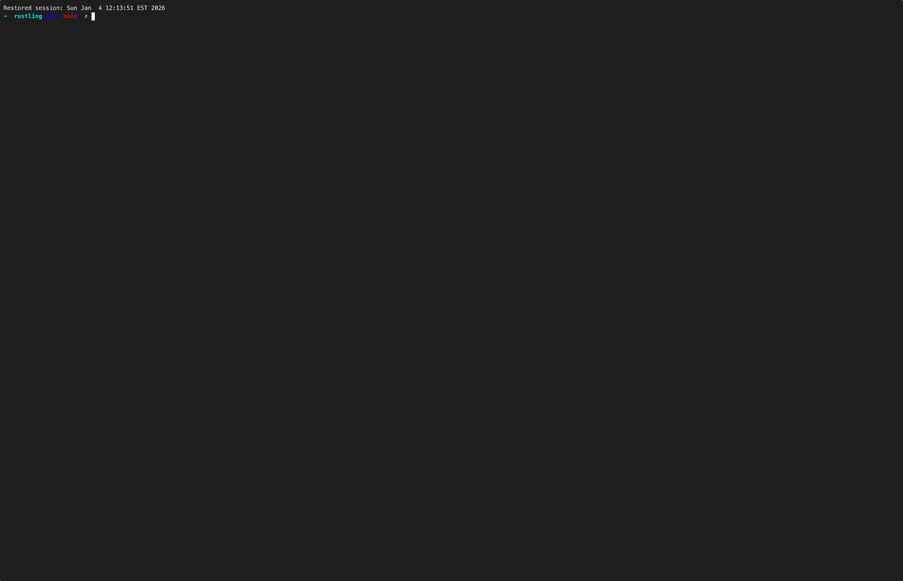
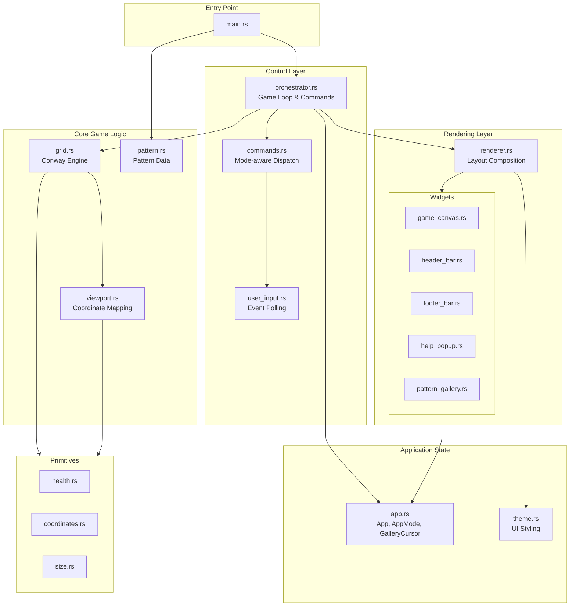

# rustmaton

A terminal-based Conway's Game of Life editor built with Rust, [ratatui](https://ratatui.rs/), and [crossterm](https://github.com/crossterm-rs/crossterm).



## Overview

- The screen displays a grid of cells, each either alive or dead
- The simulation computes the next generation using Conway's rules:
  - Alive cell with 2 or 3 alive neighbors → stays alive
  - Dead cell with exactly 3 alive neighbors → becomes alive
  - All other cells → die or stay dead

## Features

- Widget-based UI with header, footer, game canvas, and pattern gallery
- Tree-structured pattern browser with keyboard navigation
- Mouse support for cursor positioning
- Adjustable simulation speed
- Pattern rotation
- Cross-platform (macOS, Linux, Windows)

## Installation

### Pre-built Binary

```console
curl --location https://github.com/deweyjose/rustling/releases/download/0.2.5/install.sh | sh
```

### Building from Source

Requires Rust 1.70.0 or later.

```console
git clone https://github.com/deweyjose/rustling.git
cd rustling
cargo build --release
```

Binary location: `target/release/rustmaton`

## Usage

```console
# Run with default patterns.json in current directory
rustmaton

# Specify a custom patterns file
rustmaton --patterns path/to/patterns.json

# Make grid larger than viewport (default multiplier: 3)
rustmaton --multiplier 5
```

## Controls

### Normal Mode

| Key | Action |
|-----|--------|
| `↑` `↓` `←` `→` | Move cursor |
| `Tab` / `Shift+Tab` | Move cursor by 4 |
| `b` / `e` | Jump to start/end of line |
| `a` | Set cell alive |
| `d` / `Backspace` | Set cell dead |
| `1-9` | Place pattern at cursor |
| `l` | Place last pattern again |
| `r` | Rotate last pattern 90° |
| `p` | Cycle pattern type |
| `g` | Enter pattern gallery |
| `s` | Toggle simulation |
| `Space` | Step simulation forward |
| `+` / `-` | Speed up / slow down |
| `c` | Clear grid (reset on resize) |
| `h` | Show help |
| `q` / `Ctrl+C` | Quit |

### Gallery Mode (press `g` to enter)

| Key | Action |
|-----|--------|
| `↑` / `↓` | Navigate tree |
| `←` | Collapse type or go to parent |
| `→` | Expand type or enter children |
| `Enter` | Select pattern |
| `g` / `Esc` | Exit gallery mode |

### Mouse

- Left-click on the game canvas to position cursor

## Patterns

Patterns are loaded from `patterns.json`. The file contains pattern types (categories) with named patterns:

```json
[
  {
    "name": "oscillators",
    "patterns": [
      {
        "name": "blinker",
        "matrix": [[1,1,1]],
        "rotation_count": 0
      }
    ]
  }
]
```

- `matrix`: 2D array where `1` = alive, `0` = dead
- `rotation_count`: Optional (0-3), represents 0°/90°/180°/270° rotation

If no patterns file is found, a default blinker pattern is loaded.

## Architecture

### Module Overview

```
src/
├── main.rs           # Entry point, CLI parsing, pattern loading
├── app.rs            # Application state (App, AppMode, GalleryCursor)
├── orchestrator.rs   # Game loop, event handling, command execution
├── commands.rs       # Event → Command mapping, mode-aware dispatch
├── renderer.rs       # Layout composition, widget orchestration
├── user_input.rs     # Crossterm event polling
├── grid.rs           # Conway's Game of Life engine
├── viewport.rs       # Grid-to-screen coordinate conversion
├── pattern.rs        # Pattern/PatternType data structures
├── health.rs         # Cell state enum (Alive/Dead)
├── coordinates.rs    # 2D position struct
├── size.rs           # Width/height dimensions
├── theme.rs          # UI styling (colors, modifiers)
└── widgets/
    ├── mod.rs
    ├── game_canvas.rs     # Grid rendering widget
    ├── header_bar.rs      # Title bar widget
    ├── footer_bar.rs      # Status bar widget
    ├── help_popup.rs      # Help overlay widget
    └── pattern_gallery.rs # Tree-view pattern browser (StatefulWidget)
```

### Architecture Diagram



### Key Design Decisions

- **Ratatui + Crossterm**: Cross-platform TUI framework with immediate-mode rendering and efficient diff-based updates
- **Widget-based UI**: Each UI component is a separate widget implementing ratatui's `Widget` or `StatefulWidget` trait
- **Mode-aware input**: Commands are dispatched based on current mode (Normal, Help, Gallery)
- **Stateful gallery**: Pattern gallery uses `ListState` for automatic scroll-to-selection
- **Separation of concerns**: App state, rendering, and game logic are cleanly separated

### Data Flow

1. **Startup**: `main.rs` parses CLI args, loads patterns, initializes `Orchestrator`
2. **Game Loop**:
   - Poll for crossterm events
   - Map events to commands based on current mode
   - Execute commands (update App state, Grid, etc.)
   - Render frame via ratatui's `Terminal::draw()`
   - Advance simulation if running
3. **Rendering**: `Renderer` composes layout and delegates to widgets
4. **Cleanup**: Terminal restored on drop (alternate screen, raw mode disabled)

## Dependencies

| Crate | Purpose |
|-------|---------|
| [ratatui](https://crates.io/crates/ratatui) | Terminal UI framework |
| [crossterm](https://crates.io/crates/crossterm) | Cross-platform terminal manipulation |
| [clap](https://crates.io/crates/clap) | CLI argument parsing |
| [serde](https://crates.io/crates/serde) / [serde_json](https://crates.io/crates/serde_json) | Pattern file serialization |

## Development

```console
# Run in development mode
cargo run

# Run tests
cargo test

# Build release
cargo build --release
```

## License

MIT OR Apache-2.0
