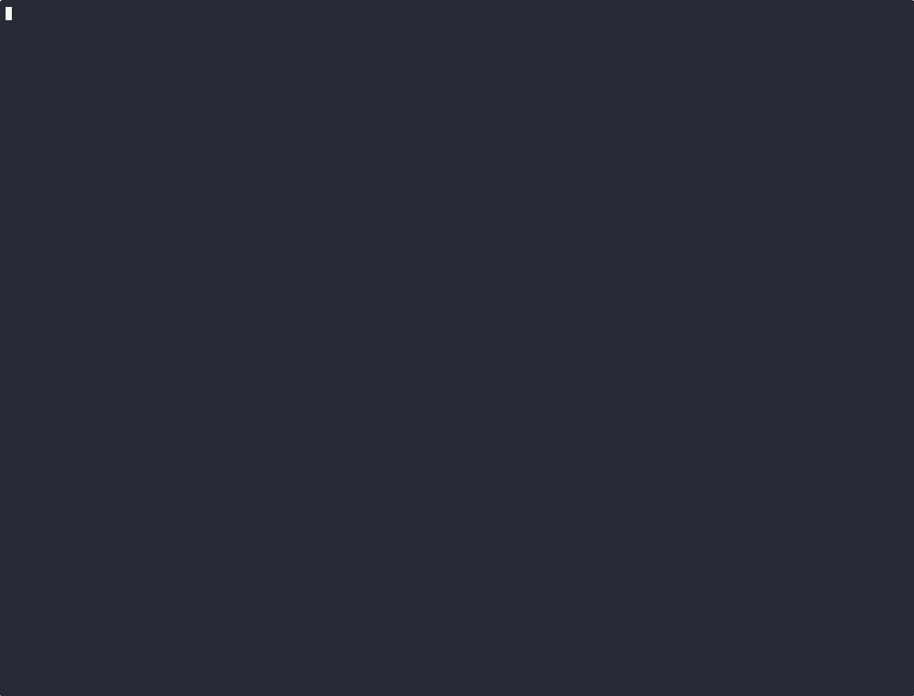
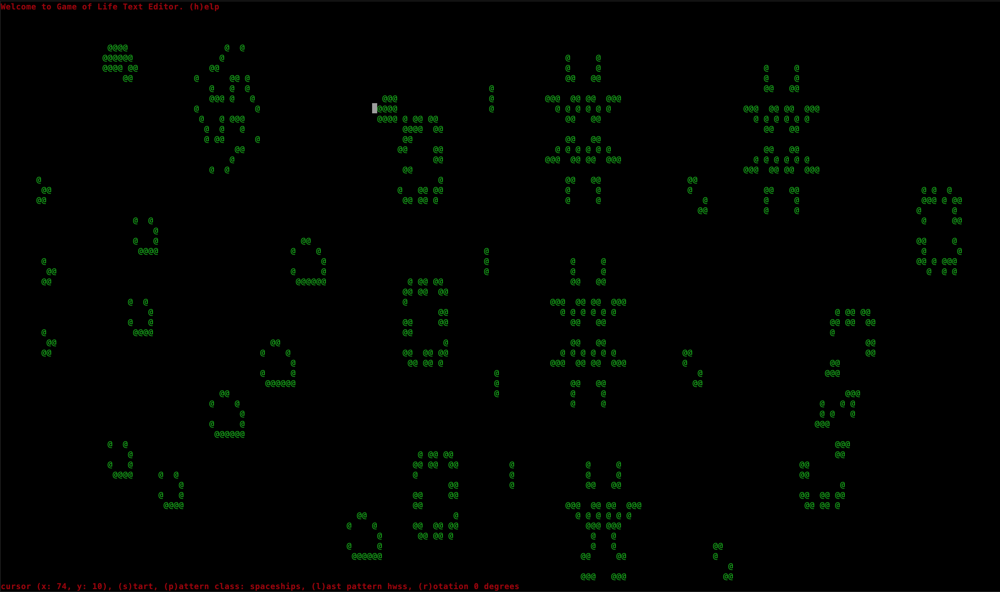

# rustmaton
A text editor version of [Conways Game of Life](https://en.wikipedia.org/wiki/Conway%27s_Game_of_Life#Algorithms) implemented in Rust.



## Overview
- The screen represents a grid of cells. 
- Each cell can be alive or dead.
- Every loop of the simulation computes the health of every cell. 
- The health of a cell is computed as follows:
  - currently Alive with 2 or 3 Alive neighbors => Alive
  - currently Dead with 3 Alive neighbors => Alive
  - all other conditions => Dead

## Game Play

It's easy - use the key pad to navigate and add more patterns to the grid. 
- up, down, left and right keys
- tab and back-tab (shift+tab)

Mouse clicks can set the cursor point for faster navigation!

You can increase or decrease the speed of the simulation using `+` or `-` keys.

If the console window is resized the game needs to be reset using the `c` key.



## Install

The installer will create a directory named `rustmaton` with the executable and patterns.json file.

```console
curl --location https://github.com/deweyjose/rustling/releases/download/0.2.4/install.sh | sh
```

## Development

### Requirements

- **Rust toolchain**: Rust 1.92.0 or later
- **Cargo**: Included with Rust (comes with `rustup`)

If you don't have Rust installed, you can install it using [rustup](https://rustup.rs/):

```console
curl --proto '=https' --tlsv1.2 -sSf https://sh.rustup.rs | sh
```

### Building from Source

Clone the repository and build the project:

```console
git clone https://github.com/deweyjose/rustling.git
cd rustling
cargo build --release
```

The compiled binary will be located at `target/release/rustmaton`.

### Running from Source

To run the development version directly:

```console
cargo run
```

Or run with a custom patterns file:

```console
cargo run -- path/to/patterns.json
```

To run the release-optimized version:

```console
cargo run --release
```

### Running Tests

Run the test suite:

```console
cargo test
```

## Usage

If [patterns.json](patterns.json) is in the current working directory no arguments need to specified to run rustling.

```console
% rustmaton
```

Or specify a path to [patterns.json](patterns.json).
```console
% rustmaton some/path/patterns.json
```

If you built your own patterns file simply supply a path to it instead.
```console
% rustmaton path/customize.json
```

### Patterns

The ga me comes with a predefined set of well known `pattern types`: `oscillators`, `stills`, `spaceships`. During the simulation only a single `pattern type` is active. The `pattern type` can be changed by pressing the `p` key.
Each `pattern type` has an array of patterns. You place a pattern on the grid by typing the number corresponding to its index in the array (not 0 based!).  Use the `h` help key to see what number key a specific pattern is.

#### patterns.json
rustmaton loads a predefined set of patterns at startup. 
Simply place [patterns.json](patterns.json) in the same directory as the rustmaton 
binary and run it. Feel free to customize the list of patterns, 
or even define you're own patterns.

If no shape file can be found at startup a simple blinker is loaded as the default shape.

Example structure
```json
[
  {
    "name": "methuselahs",
    "patterns": [
      {
        "name": "r-pentomino",
        "matrix": [
          [0,1,1],
          [1,1,0],
          [0,1,0]
        ]
      }
    ]
  }
]
```

### Cells

Individual cells can be manually set to `Alive` or `Dead` using the `a` or `d` key. 

## Help
Press the `h` key to display or hide help. The simulation is paused while help is displayed.

Below is an example of the help screen. If you've made any customizations to [patterns.json](patterns.json) they will be reflected in the help screen.

```console
# command keys:
a       - toggle cursor point alive
b       - move cursor to the beginning of the current line
c       - clear the screen
d       - toggle cursor point dead
e       - move cursor to the end of the current line
h       - display help, or exit help if currently rendered
l       - print the previous pattern again
p       - cycle through the pattern classes defined in patterns.json
q       - quit
r       - rotate the current shape 90 degrees
s       - toggle the simulation run loop
' '     - step the simulation forward
+       - speed up the simulation
-       - slow down the simulation
[esc]   - exit help
ctrl+c  - quit

# pattern classes
Select a different pattern class using the p key
Print a shape using the number in () to the left of the name
oscillators
 (1) beacon, (2) blinker, (3) koks galaxy, (4) pulsar, (5) toad
spaceships
 (1) glider, (2) lwss, (3) hwss
still
 (1) beehive, (2) block, (3) boat, (4) loaf, (5) tub
```
